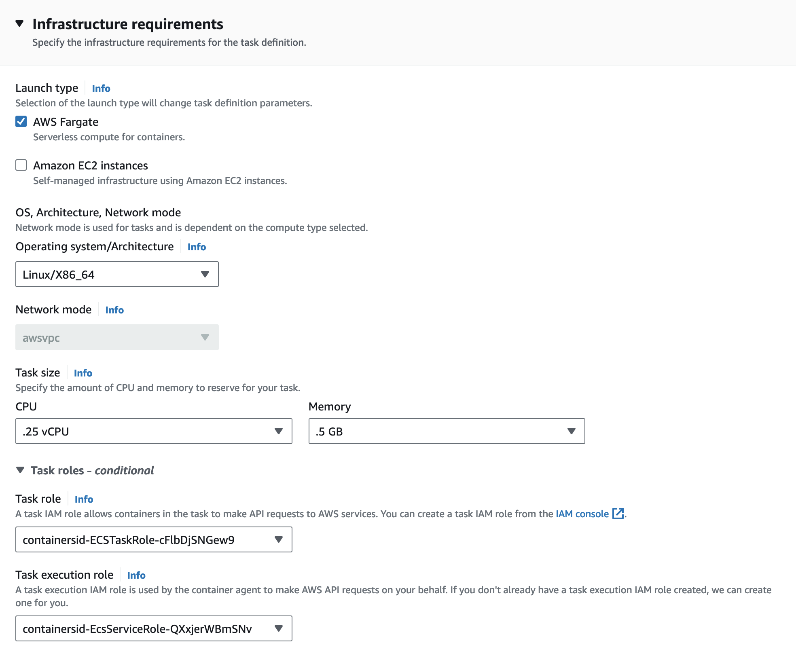
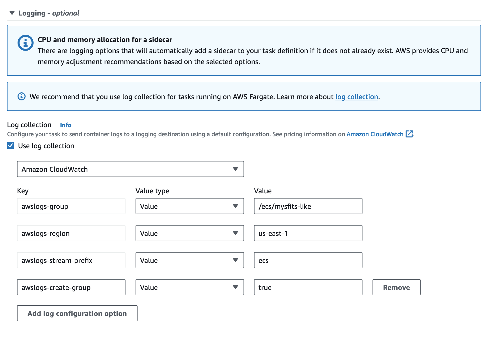

# Lab 4. Incrementally build and deploy more microservices with AWS Fargate

이제 모놀리스를 마이크로서비스로 분리해야 할 때입니다. 이를 위해 모놀리스의 작동 방식을 좀 더 자세히 살펴보겠습니다.

> 모노리스는 다양한 경로로 여러 API 리소스를 제공하며 Mysfits에 대한 정보를 가져오거나 “좋아요”와 입양을 처리합니다.<br/><br/>
> 이러한 리소스의 로직은 일반적으로 일부 “처리" (예: 사용자가 특정 작업을 수행할 수 있는지, Mysfit을 입양할 수 있는지 확인 등) 와 지속성 계층 (이 경우 DynamoDB) 과의 상호 작용으로 구성됩니다.<br/><br/>
> 여러 서비스가 단일 데이터베이스와 직접 통신하도록 하는 것은 좋지 않은 생각인 경우가 많습니다 (인덱스를 추가하고 데이터 마이그레이션을 수행하는 것은 하나의 애플리케이션만으로도 충분히 어렵습니다). 따라서 주어진 리소스의 모든 로직을 별도의 서비스로 분리하는 대신 먼저 일부의 “처리” 비즈니스 로직만 별도의 서비스로 옮기고 계속해서 데이터베이스 앞단에 파사드로서 동작하는 모노리스를 사용합니다. 이 패턴은 때때로 [Strangler Application Pattern](https://www.martinfowler.com/bliki/StranglerApplication.html)이라고 하는데, 모노리스를 “strangling”해서 뽑아내고 완전히 교체할 수 있을 때까지 옮기기 가장 어려운 부분에 대해서 계속 사용하기 때문입니다.<br/><br/>
>ALB에는 URL 경로를 기반으로 트래픽을 특정 대상 그룹으로 라우팅하는 [경로 기반 라우팅](https://docs.aws.amazon.com/elasticloadbalancing/latest/application/load-balancer-listeners.html#path-conditions)이라는 또 다른 기능이 있습니다. 즉, 마이크로서비스를 호스팅하는 데 ALB의 단일 인스턴스만 있으면 됩니다. 모놀리스 서비스는 기본 경로인 '/'에 대한 모든 트래픽을 수신합니다. 입양 및 좋아요 서비스는 각각 '/adopt' 및 '/like'로 동작합니다.

우리가 구현할 내용은 다음과 같습니다.


* Note: 주황색 태스크는 모노리스를 나타내고 파란색 태스크는 좋아요 마이크로서비스를 나타냅니다.

모놀리스와 마찬가지로 Fargate를 사용하여 이러한 마이크로서비스를 배포하게 되지만, 이번에는 새로운 서비스를 위한 모든 배포 단계를 살펴보겠습니다.

## 지침

### 1. 글루(glue) 코드 추가

먼저, “like” 함수를 별도의 서비스로 이동할 수 있도록 모노리스에 glue 코드를 추가해야 합니다. Cloud9 환경을 사용하여 이 작업을 수행하게 됩니다. 만일 탭을 닫았으면 [Cloud9 대시보드](https://console.aws.amazon.com/cloud9/home)로 이동하여 환경을 찾아보세요. “IDE 열기”를 클릭합니다. app/monolith-service/service/mythicalMysfitsService.py 소스 파일을 찾아 다음 섹션의 주석 처리를 제거합니다.

```python
# @app.route("/mysfits/<mysfit_id>/fulfill-like", methods=['POST'])
# def fulfillLikeMysfit(mysfit_id):
#     serviceResponse = mysfitsTableClient.likeMysfit(mysfit_id)
#     flaskResponse = Response(serviceResponse)
#     flaskResponse.headers["Content-Type"] = "application/json"
#     return flaskResponse
```

이렇게 하면 DynamoDB에 지속성을 관리할 수 있는 엔드포인트가 제공되지만 process_like_request 함수로 처리되는 “비즈니스 로직"(예, 이 경우에는 인쇄 명령문이지만 실제로는 권한 확인 또는 기타 간단한 처리가 포함될 수 있음)은 생략됩니다.

### 2. 새로운 이미지 빌드 및 업로드

모놀리스 애플리케이션에 이 새로운 기능을 추가하면, 이전과 마찬가지로 nolike와 같은 새 태그를 사용하여 모놀리스 컨테이너 이미지를 다시 빌드한 다음 이를 ECR로 푸시합니다.

```bash
cd ~/environment/amazon-ecs-mythicalmysfits-workshop/workshop-1/app/monolith-service
MONO_ECR_REPOSITORY_URI=$(aws ecr describe-repositories | jq -r .repositories[].repositoryUri | grep mono)
# Rebuild, and tag, the container image with the new changes incorporated
docker build -t monolith-service:nolike .
# Update the tag of the new container image with the repository information
docker tag monolith-service:nolike $MONO_ECR_REPOSITORY_URI:nolike
# Push the container image to Amazon ECR
docker push $MONO_ECR_REPOSITORY_URI:nolike
```

### 3. 새로운 버전 적용

랩 2에서와 마찬가지로 모놀리스 작업 정의의 새 버전을 만드십시오. 이번에는 작업 정의가 방금 ECR에 푸시된 컨테이너 이미지의 'nolike' 버전을 참조합니다. Lab 3에서와 마찬가지로 이 수정 버전을 사용하도록 모놀리스 서비스를 업데이트합니다.

<details close>
  <summary>새로운 task definition revision을 생성하고 서비스를 업데이트하는 방법</summary>

AWS 관리 콘솔에서 ECS 콘솔의 [작업 정의](https://console.aws.amazon.com/ecs/home#/taskDefinitions)로 이동합니다. `Monolith-Definition-<STACK_NAME>`라는 이름의 작업 정의를 찾으십시오. 작업 정의를 선택하고 **Create new revision**을 클릭합니다. `Container - 1` 에서 `Container Details`를 찾습니다. `:nolike` 태그를 사용하여 방금 ECR에 푸시한 모놀리스 컨테이너 이미지의 이미지 URI를 가리키도록 **monolith-service**라는 컨테이너의 “이미지 URI”를 업데이트하십시오. **Create** 버튼을 클릭하여 새 작업 정의 수정 버전을 저장합니다.

그런 다음 ECS 콘솔에서 [클러스터](https://console.aws.amazon.com/ecs/home#/clusters)로 이동합니다.`Cluster-<STACK_NAME>`라는 이름의 ECS 클러스터를 찾으십시오. 클러스터 이름을 클릭하면 자세한 내용을 볼 수 있습니다. 서비스 탭에 `<STACK_NAME>-MythicalMonolithService-XXX`라는 이름의 서비스가 표시될 것입니다. 서비스 이름 옆의 체크박스를 선택하고 **Update**를 클릭합니다.

배포 구성 섹션에서 작업 정의 수정 버전을 위에서 만든 revision(보통 LATEST 버전)으로 업데이트합니다. 그런 다음 **Update**를 클릭합니다.

</details>
<br/>

### 4. Like 서비스 이미지 빌드 및 업로드

모놀리스 서비스(nolike)를 빌드하고 배포했으니, 이제 like 서비스를 빌드하고 컨테이너 이미지를 ECR로 푸시할 차례입니다.

Like 서비스 ECR 리포지토리 URI를 찾으려면 ECS 대시보드의 [리포지토리](https://console.aws.amazon.com/ecs/home#/repositories)로 이동하여 `STACK_NAME-like-XXX`와 같은 이름의 리포지토리를 찾으십시오. **Like** 리포지토리의 URI 옆에 있는 복사 아이콘을 클릭하여 리포지토리 URI를 복사합니다.


다음 명령을 Cloud9 IDE에 복사하여 like 컨테이너 이미지를 빌드하고 ECR로 푸시합니다. 명령의 설명을 검토하여 각 단계가 수행하는 작업을 이해하세요.

```bash
# Change to the directory containing the like service code
cd ~/environment/amazon-ecs-mythicalmysfits-workshop/workshop-1/app/like-service
# Create an environment variable called LIKE_ECR_REPOSITORY_URI and populate it with the URI for like service repository
LIKE_ECR_REPOSITORY_URI=$(aws ecr describe-repositories | jq -r .repositories[].repositoryUri | grep like)
# Build the like container image
docker build -t like-service .
# Update the tag of the new container image with the repository information
docker tag like-service:latest $LIKE_ECR_REPOSITORY_URI:latest
# Push the container image to Amazon ECR
docker push $LIKE_ECR_REPOSITORY_URI:latest
```

### 5. Task Definition 생성

다음 단계는 방금 ECR로 푸시된 컨테이너 이미지를 사용하는 유사 서비스에 대한 새 작업 정의를 생성하는 것입니다.

ECS 대시보드에서 [작업 정의](https://console.aws.amazon.com/ecs/home#/taskDefinitions)로 이동합니다. **Create new task definition**을 클릭합니다. 드롭다운 목록에서 **Create new task definition**을 선택합니다.

**Task definition family**를 mysfits-like로 설정합니다.

**Infrastructure requirements** 섹션의 내용은 아래와 같은 값을 입력합니다.

* **Launch type** - AWS Fargate
* **CPU** - .25 vCPU
* **Memory** - .5 GB

"[Task role](https://docs.aws.amazon.com/AmazonECS/latest/developerguide/task_execution_IAM_role.html)" 섹션의 경우, 컨테이너에서 실행되는 애플리케이션은 다른 AWS 서비스 (예: DynamoDB) 와 상호 작용할 수 있는 권한이 필요합니다. 모놀리스 서비스용으로 이미 생성된 `STACK_NAME-EcsTaskRole-XXXXX`와 같은 이름을 가진 역할을 선택합니다.

“[Task excution role](https://docs.aws.amazon.com/AmazonECS/latest/developerguide/task_execution_IAM_role.html)” 섹션의 경우 Fargate는 컨테이너 이미지를 가져와 CloudWatch에 기록할 수 있는 IAM 역할이 필요합니다. 모놀리스 서비스용으로 이미 생성된 `STACK_NAME-EcsServiceRole-XXXXX`와 같은 이름을 가진 역할을 선택합니다.



**Container - 1**에서 **Container Details** 섹션을 찾아 다음 필드에 값을 입력합니다.

* **Name** - mysfits-like
* **Image URI** - ECR에 저장된 컨테이너 이미지에 대한 참조입니다. 형식은 like 서비스 컨테이너를 ECR로 푸시할 때 사용한 값과 같아야 합니다 - ECR_REPOSITORY_URI:latest
* **Container port** - 80
* **Protocol** - TCP
* **App protocol** - HTTP

like 서비스 코드는 데이터를 DynamoDB에 유지하기 위해 모놀리스의 엔드포인트를 호출하도록 설계되었습니다. MONOLITH_URL이라는 환경 변수를 참조하여 주문 처리 전송 위치를 파악합니다.

아래로 스크롤하여 “환경 변수” 섹션으로 이동합니다. **Add environment variable**를 클릭하여 키로 MONOLITH_URL을 사용하는 환경 변수를 생성합니다. 현재 모노리스 앞에 있는 **ALB DNS name**을 값으로 입력합니다.

예를 들면 다음과 같습니다 (alb-mysfits-1892029901.eu-west-1.elb.amazonaws.com과 같이 “http”나 슬래시 없이 호스트 이름만 입력해야 합니다).


Fargate를 사용하면 CloudWatch에 편리하게 로그인할 수 있습니다. 기본 로그 설정을 유지하고 **awslogs-group**과 **awslogs-stream-prefix**를 기록해 두면 나중에 이 작업에 사용할 로그를 찾을 수 있습니다.

예를 들면 다음과 같습니다.



작업 정의를 검토하고 **Create**을 클릭하여 작업 정의를 생성합니다.

### 6. Service 생성

방금 생성한 Like Service 작업 정의를 실행할 ECS 서비스를 생성하고 기존 ALB에 연결합니다.

방금 생성한 Like 작업 정의의 새 revision으로 이동합니다. **Deploy** 드롭다운에서 **Create service**을 선택합니다.

다음 화면의 **Environment** 섹션에서 다음 필드에 값을 입력합니다.

* **Existing cluster** - 워크샵 클러스터를 선택
* **Launch type** - **FARGATE**를 선택하고 **Plaform version**이 **LATEST**가 맞는지 확인

예를 들면 다음과 같습니다.


**Deployment configuration** 섹션에서 다음 필드에 값을 입력합니다.

* **Service name** - 서비스 이름을 입력 (e.g. mysfits-like-service)
* **Desired tasks** - 1을 입력

네트워킹 섹션을 확장합니다.

작업 정의에서는 awsvpc 네트워크 모드를 사용하므로 작업을 호스팅할 VPC와 서브넷을 선택할 수 있습니다.

**VPC**의 경우 워크샵 VPC를 선택합니다. 이름은 `Mysfits-VPC-<STACK_NAME>`와 같습니다.

**Subnets**의 경우 프라이빗 서브넷을 선택합니다. `Mysfits-PrivateOne-<STACK_NAME>`과 같은 태그를 기반으로 프라이빗 서브넷을 식별할 수 있습니다.

**Security group name**으로 기존 보안 그룹 사용을 선택하고 목록에서 `SecurityGroup-<STACK_NAME>`과 같은 이름의 보안 그룹을 선택합니다.

예를 들면 다음과 같습니다.


**Load balancing** 섹션을 확장합니다.

**Load balancer type**으로는 **Application Load Balancer**를 선택합니다. 그런 다음 **Use an existing load balancer** 옵션을 선택합니다.

**Load balancer name** 드롭다운 메뉴가 나타납니다. 모놀리스 ECS 서비스에 사용된 것과 동일한 Mythical Mysfits ALB를 선택합니다. 이름은 **alb-STACK_NAME**과 같습니다.

**Choose container to load balance** 드롭다운의 드롭다운 메뉴에서 like 서비스 작업 정의에 해당하는 **Container name : port** 콤보를 선택합니다.

**Listener**의 경우 **Use an existing listener**을 선택하고 드롭다운에서 **80:\HTTP**를 선택합니다.

**Target group name**의 경우 좋아요 컨테이너에 대한 새 그룹을 생성해야 하므로 **Create new target group**로 그대로 두고 **Target group name**을 `mysfits-like`로 설정합니다. 이 이름은 대상 그룹을 식별하기 위한 친숙한 이름이므로 Like 마이크로서비스와 관련된 값이 적합합니다.

경로 패턴을 `/mysfits/*/like`로 변경합니다. ALB는 이 경로를 사용하여 트래픽을 유사한 서비스 대상 그룹으로 라우팅합니다. 이는 동일한 ALB 리스너에서 여러 서비스를 제공하는 방법입니다. 모놀리스 대상 그룹에 대한 기존 기본 경로 경로를 기록해 두십시오.

**Evaluation order**에 1을 입력합니다. **Health check path**를 /로 설정합니다.

구성은 다음과 비슷해야 합니다.


다른 필드는 기본값으로 두고 **Create**를 클릭합니다.

ECS 클러스터 서비스 페이지에서 작업 정의가 서비스로 배포된 것을 확인할 수 있습니다. **PROVISIONING** 상태에서 시작하여 **PENDING** 상태로 진행되며, 구성이 성공하면 서비스는 최종적으로 **RUNNING** 상태로 전환됩니다. 새로 고침 버튼을 주기적으로 클릭하면 이러한 상태 변화를 확인할 수 있습니다.


### 7. 좋아요 기능 테스트

새로운 좋아요 서비스가 배포되면 웹사이트를 방문하여 Mysfit 좋아요 기능을 다시 테스트해 보세요. CloudWatch 로그를 다시 확인하고 좋아요 서비스에 이제 “Like processed” 메시지가 표시되는지 확인하십시오. 이 메시지가 표시되면 Like 기능을 새 마이크로서비스에 성공적으로 도입한 것입니다.

### 8. 사용하지 않는 엔드포인트 제거

시간이 있다면 이제 더 이상 프로덕션 환경에서 사용되지 않으므로 이전 Like 엔드포인트를 모놀리스에서 제거할 수 있습니다.

모놀리스 및 Like 서비스 컨테이너 이미지를 빌드한 Cloud9 환경으로 돌아가십시오.

모노리스 폴더에서 Cloud9 에디터에서 mythicalMysfitsService.py 파일을 열고 다음과 같은 코드를 찾으세요.

```python
# increment the number of likes for the provided mysfit.
@app.route("/mysfits/<mysfit_id>/like", methods=['POST'])
def likeMysfit(mysfit_id):
    serviceResponse = mysfitsTableClient.likeMysfit(mysfit_id)
    process_like_request()
    flaskResponse = Response(serviceResponse)
    flaskResponse.headers["Content-Type"] = "application/json"
    return flaskResponse
```

해당 줄을 찾으면 삭제하거나 주석을 달 수 있습니다.

### 9. 모노리스 이미지 빌드 및 업로드

모놀리스 이미지를 빌드하고 태그를 지정하고 모놀리스 ECR 저장소로 푸시합니다.

이제 nolike 대신 nolike2 태그를 사용하세요.

```bash
# Change to the directory containing the like service code
cd ~/environment/amazon-ecs-mythicalmysfits-workshop/workshop-1/app/monolith-service 
# Build the like container image with a revised tag
docker build -t monolith-service:nolike2 .
# Update the tag of the new container image with the repository information
docker tag monolith-service:nolike2 $MONO_ECR_REPOSITORY_URI:nolike2
# Push the container image to Amazon ECR
docker push $MONO_ECR_REPOSITORY_URI:nolike2
```

ECR의 모놀리스 리포지토리를 보면 푸시된 이미지에 nolike2 태그가 지정된 것을 볼 수 있습니다.


### 10. Task Definition 생성 및 서비스 업데이트

이제 모놀리스가 이 새 컨테이너 이미지 URI를 참조할 수 있도록 마지막 작업 정의를 만들고(이 프로세스는 이제 익숙할 것이며 이 번거로운 작업은 프로덕션 환경의 CI/CD 서비스에 맡기는 것이 합리적이라는 것을 알 수 있을 것입니다), 새 작업 정의를 사용하도록 모놀리스 서비스를 업데이트하고, 앱이 여전히 이전과 같이 작동하는지 확인합니다. 새 작업 정의 수정 버전을 만들고 서비스를 업데이트하는 방법을 기억하지 못하는 경우 다음 힌트를 확장하세요.

<details close>
  <summary>새 작업 정의 수정 버전을 생성하고 서비스를 업데이트하는 방법</summary>

<br/>AWS 관리 콘솔에서 ECS 콘솔의 [작업 정의](https://console.aws.amazon.com/ecs/home#/taskDefinitions)로 이동합니다. `Monolith-Definition-<STACK_NAME>`라는 이름의 작업 정의를 찾으십시오. 작업 정의를 선택하고 **Create new revision**을 클릭합니다. **Container - 1**에서 **Container Details**를 찾습니다. `:nolike2` 태그를 사용하여 방금 ECR에 푸시한 모놀리스 컨테이너 이미지의 이미지 URI를 가리키도록 **monolith-service**라는 컨테이너의 “Image URI”를 업데이트하십시오. **Create** 버튼을 클릭하여 새 작업 정의 revision을 저장합니다.

다음으로 ECS 콘솔에서 [클러스터](https://console.aws.amazon.com/ecs/home#/clusters)로 이동합니다. `Cluster-<STACK_NAME>`라는 이름의 ECS 클러스터를 찾으십시오. 클러스터 이름을 클릭하면 자세한 내용을 볼 수 있습니다. 서비스 탭에 `<STACK_NAME>-MythicalMonolithService-XXX`라는 이름의 서비스가 표시될 것입니다. 서비스 이름 옆의 체크박스를 선택하고 **Update**를 클릭합니다.

**Deployment configuration** 섹션에서 작업 정의 **Revision**을 위에서 만든 수정 버전(보통 LATEST)으로 업데이트합니다. 그런 다음 **Update**를 클릭합니다.
</details>
<br/>

## Checkpoint

축하합니다. 모놀리스에서 Like 마이크로서비스를 성공적으로 출시했습니다. 시간이 있다면 이 실습을 반복하여 도입 마이크로서비스를 자세히 살펴보세요.
